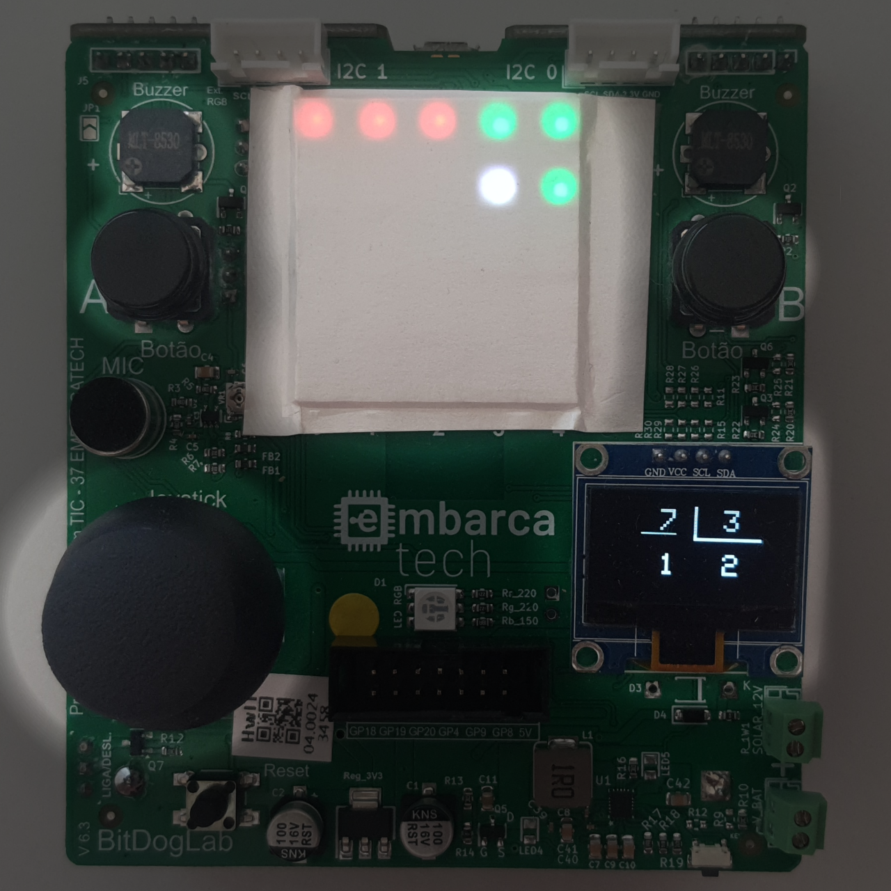

# BitDogAcademy

## 🎯 Objetivo do Projeto
BitDogAcademy é uma plataforma interativa desenvolvida no programa EmbarcaTech para auxiliar no ensino fundamental. A proposta combina visualizações dinâmicas e atividades visuais e interativas para tornar o aprendizado mais envolvente e acessível.

## 🔧 Componentes Usados
- Raspberry Pi Pico W
- Matriz de LEDs RGB 5x5
- Display OLED 0,96”
- Buzzer passivo
- Joystick com botão integrado
- 2x Push Buttons
- Bateria recarregável

## 💾 Como Compilar e Executar o Código
Para compilar e executar o projeto, utilize o **VSCode** com a extensão para projetos **Pi Pico**. Carregue o projeto na extensão e envie o programa para o microcontrolador.

🔗 Extensão do VSCode: [Raspberry Pi Pico SDK Extension](https://github.com/raspberrypi/pico-vscode)

## ⚡ Pinagem dos Dispositivos Utilizados
| Pino | Função | Periférico |
|------|--------|------------|
| 5  | GPIO + Interrupção | Botão A |
| 6  | GPIO + Interrupção | Botão B |
| 7  | PIO | Matriz de LED |
| 14 | I2C1 - SDA | Display OLED |
| 15 | I2C1 - SCL | Display OLED |
| 21 | PWM | Buzzer |
| 22 | GPIO + Interrupção | Botão Joystick |
| 26 | ADC | Joystick - X |
| 27 | ADC | Joystick - Y |

## 🖼️ Imagens e Vídeos

- **Foto da atividade de divisão inteira em execução**:

- **Vídeo de Apresentação**: [Assista aqui](https://www.youtube.com/watch?v=xHCL8hOfLEQ)

## 📈 Resultados
A implementação do projeto foi bem-sucedida, atendendo aos requisitos especificados no início do desenvolvimento. Embora apenas uma atividade tenha sido implementada, a estrutura modular do software permite fácil expansão para suportar uma ampla variedade de atividades educacionais.

A experiência interativa proporcionada pelo hardware demonstrou um funcionamento eficaz, garantindo responsividade e fluidez na interação do usuário. O uso de visualizações dinâmicas e feedback sonoro reforçou a experiência imersiva do sistema. 

Futuramente, melhorias podem incluir a adição de novas atividades, registro de progresso do usuário e suporte para interações colaborativas, ampliando ainda mais o potencial da plataforma como ferramenta educacional.

## 📎 Links Adicionais
- **Documentação Completa**: [Acesse aqui](https://docs.google.com/document/d/1Y5T07P8tk9wgpiRu8o5c3_4_7WWCqSvCT_-G4AARzdE/edit?usp=sharing)
- **Repositório Original**: [Github do Projeto](https://github.com/ThiagoMaxPavao/BitDogAcademy)

**Nota**: Este repositório é uma cópia do original, realizada em 01/04/2025.
