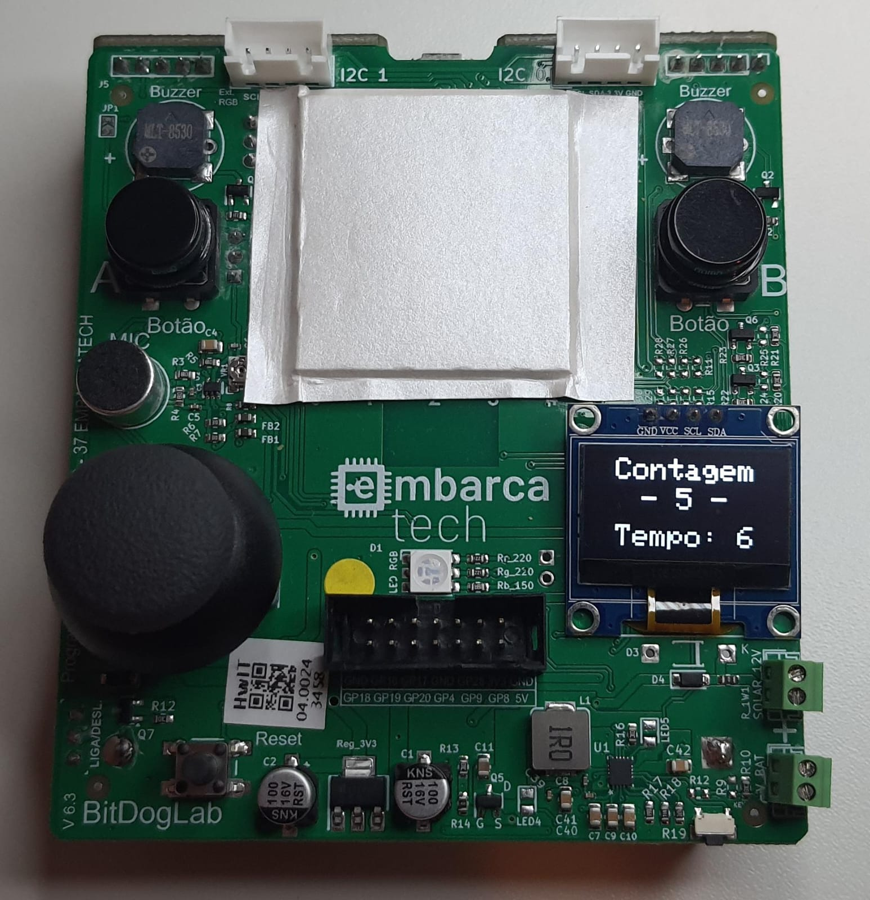

# Contador Decrescente

## 🎯 Objetivo do Projeto

Este projeto consiste em um contador de cliques com cronômetro. Ao iniciar a contagem de tempo com o Botão A, o usuário tem 9 segundos para pressionar o Botão B o maior número de vezes possível. O objetivo principal é exercitar a detecção de eventos em sistemas embarcados, com ênfase na solução do problema de *bouncing* (ruído mecânico) em botões, que pode causar múltiplas detecções indevidas para um único clique.

O desenvolvimento também envolveu o uso de técnicas de interrupção (para detecção de pressionamento dos botões) e de temporização (para controlar a contagem regressiva).

## 🔧 Componentes Utilizados

- Raspberry Pi Pico W
- Display OLED 0,96” (via I2C)
- 2x Push Buttons
- Bateria recarregável

## 💾 Como Compilar e Executar o Código

1. Abra o projeto no VSCode, utilizando um ambiente com suporte ao SDK do Raspberry Pi Pico (CMake + compilador ARM);
2. Compile o projeto (Ctrl+Shift+B no VSCode ou via terminal com `cmake` e `make`);
3. Conecte a Raspberry Pi Pico via cabo USB, pressionando o botão **BOOTSEL** ao conectar para ativar o modo de boot;
4. Copie o arquivo `.uf2` gerado para a unidade de armazenamento "RPI-RP2" que aparecerá;
5. A Pico reiniciará automaticamente e iniciará a execução do programa;
6. Siga as instruções exibidas no display OLED para iniciar a contagem.

🔗 Extensão recomendada para VSCode: [Raspberry Pi Pico SDK Extension](https://github.com/raspberrypi/pico-vscode)

## ⚡ Pinagem dos Dispositivos Utilizados

| Pino | Função               | Periférico     |
|------|----------------------|----------------|
| 5    | GPIO + Interrupção   | Botão A        |
| 6    | GPIO + Interrupção   | Botão B        |
| 14   | I2C1 - SDA           | Display OLED   |
| 15   | I2C1 - SCL           | Display OLED   |

## 🖼️ Imagens e Vídeos

- **Foto do programa em execução:** Com 5 cliques registrados e 6 segundos restantes para o fim.

## 🧠 Lógica de Funcionamento

1. **Início da contagem:**
   - Ao pressionar o **Botão A** (GPIO5), o contador é iniciado com valor 9 e mostrado no display OLED;
   - Começa a contagem regressiva, decrementando 1 a cada segundo;

2. **Contagem de cliques:**
   - Durante a contagem regressiva (de 9 até 0), os cliques no **Botão B** (GPIO6) são registrados e contabilizados;
   - O número de cliques é atualizado em tempo real no display OLED;

3. **Fim da contagem:**
   - Quando o contador chega a zero, os cliques adicionais no Botão B são ignorados;
   - O sistema congela exibindo:
     - Contador zerado (0 segundos);
     - Total de cliques registrados durante o período ativo;

4. **Reinício do ciclo:**
   - Pressionar o Botão A novamente reinicia o ciclo:
     - O contador volta para 9;
     - O número de cliques é zerado;
     - A contagem regressiva recomeça.

## 📂 Estrutura de Arquivos

O código-fonte se encontra na pasta `_src_`, destacam-se os arquivos:

- `ContadorDecrescente.c`: Lógica principal, configuração dos botões e renderização no display;
- `inc/ssd1306.c` e `inc/ssd1306.h`: Biblioteca para comunicação com o display OLED via I2C.

## 📊 Resultados

- Sistema responsivo e eficaz no controle de contagem e detecção de cliques;
- Solução simples e funcional para o problema de *debounce*;
- Interface visual clara para o usuário.
