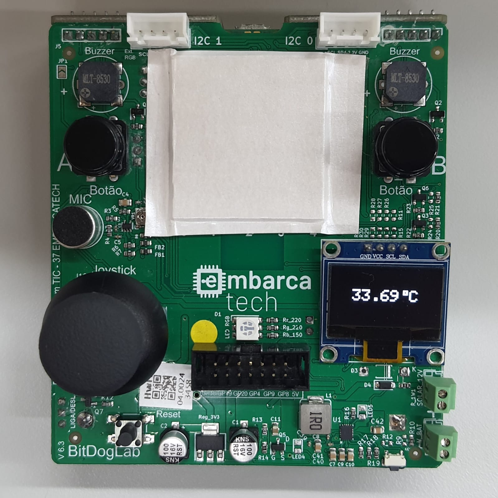

# Temperatura Interna

## 🎯 Objetivo do Projeto

Este projeto realiza a leitura da temperatura interna do microcontrolador Raspberry Pi Pico W utilizando seu sensor embutido. A temperatura é convertida e exibida em tempo real em um display OLED, com atualização a cada segundo.

O objetivo principal é demonstrar a leitura de valores analógicos internos por meio do ADC e a conversão desses dados para uma representação em graus Celsius.

Durante os testes, foi observado que os valores de temperatura variam rapidamente, como por exemplo, de 29°C para 37°C em apenas um segundo, devido à baixa precisão e instabilidade térmica do sensor interno.

### 📌 Atualização: este programa foi modificado para incluir um teste de unidade, conforme detalhado na seção específica abaixo.

## 🔧 Componentes Utilizados

- Raspberry Pi Pico W
- Display OLED 0,96” (via I2C)

## 💾 Como Compilar e Executar o Código

1. Abra o projeto no VSCode, utilizando um ambiente com suporte ao SDK do Raspberry Pi Pico (CMake + compilador ARM);
2. Compile o projeto (Ctrl+Shift+B no VSCode ou via terminal com `cmake` e `make`);
3. Conecte a Raspberry Pi Pico via cabo USB, pressionando o botão **BOOTSEL** ao conectar, para ativar o modo de boot;
4. Copie o arquivo `.uf2` gerado para a unidade de armazenamento "RPI-RP2" que aparecerá;
5. A Pico reiniciará automaticamente e iniciará a execução do programa.

🔗 Extensão recomendada para o VSCode: [Raspberry Pi Pico SDK Extension](https://github.com/raspberrypi/pico-vscode)

## ⚡ Pinagem dos Dispositivos Utilizados

| Pino | Função     | Periférico             |
|:-----|:------------|:----------------------|
| X    | ADC        | Sensor de temperatura  |
| 14   | I2C1 - SDA | Display OLED           |
| 15   | I2C1 - SCL | Display OLED           |

⚠️ O sensor de temperatura interno da Raspberry Pi Pico não está ligado a um pino GPIO externo, por isso, nesta tabela, o pino foi representado com `X`.

## 🖼️ Imagens e Vídeos

- **Foto do programa em execução:** medindo aproximadamente 34°C.



## 🧠 Lógica de Funcionamento

1. **Inicialização:**
   - Ativa o sensor de temperatura interno e seleciona o canal ADC correspondente;
   - Inicializa o display OLED via I2C.

2. **Leitura e Conversão:**
   - A cada segundo, realiza uma leitura do ADC e converte o valor para temperatura em Celsius;
   - A temperatura é formatada e exibida no centro do display OLED.

## 📂 Estrutura de Arquivos

### Programa Principal

- `app/main.c`: Lógica principal de leitura e exibição da temperatura;
- `app/convert_temperature.c`: Função de conversão da leitura do ADC para temperatura (graus Celsius);
- `inc/ssd1306.c` e `inc/ssd1306.h`: Biblioteca para controle do display OLED.

### Arquivos para Testes de Unidade

- `unity/`: Diretório com a biblioteca de testes de unidade;
- `test/test.c`: Programa principal de testes;
- `run_tests.sh`: Script para compilação e execução dos testes de unidade.

## 🧪 Testes de Unidade

Foi implementado um teste de unidade para a função `adc_to_celsius`, localizada no arquivo `app/convert_temperature.c`. Esta função converte o valor digital retornado pelo ADC em uma temperatura em Celsius. O teste, definido no arquivo `test/test.c` utilizando a biblioteca Unity, compara a saída da função para um valor de entrada conhecido, verificando se o erro é inferior a 0,5°C.

Para executar o teste:

1. Certifique-se de que o script `run_tests.sh` tenha permissão de execução (`chmod +x run_tests.sh`);
2. Execute o script no terminal: `./run_tests.sh`.

A saída será um relatório dos testes, como o exemplo abaixo:

```
Running unit tests...

/home/.../test/test.c:20:test_adc_to_celsius:PASS

-----------------------
1 Tests 0 Failures 0 Ignored 
OK
```

## 📊 Resultados

- Leitura funcional da temperatura interna;
- Variação significativa nos valores devido à baixa precisão do sensor embutido;
- Visualização clara e atualização automática no display OLED;
- Teste de unidade funcional.
